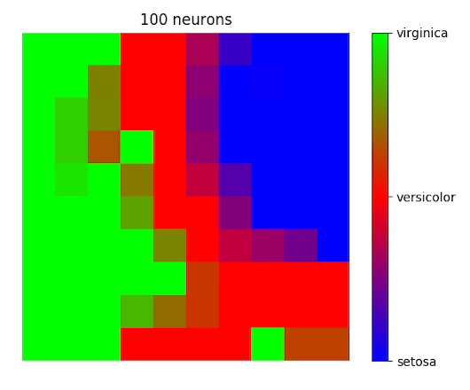
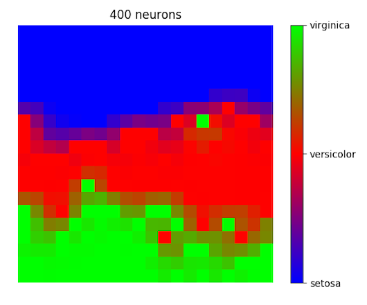
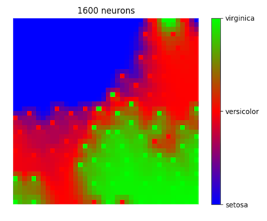

# Kohonen Network
[Self-organizing map (SOM)](https://en.wikipedia.org/wiki/Self-organizing_map) for visualizing multidimensional data in a 2D grid. The default example uses the [Iris flower dataset](https://en.wikipedia.org/wiki/Iris_flower_data_set).

<p align="center">
  
  
  
</p>


These embeddings were made with learning rate of 1, radius of 2 and 100 iterations.


## Installation

To install the dependencies, run the following command:

```bash
pip install -r requirements.txt
```

If using Conda, you can also create an environment with the requirements:

```bash
conda env create -f environment.yml
```

By default the environment name is `kohonen-network`. To activate it run:

```bash
conda activate kohonen-network
```


## Usage

Run the algorithm from the command line with:

```python
python kohonen_network.py
```

